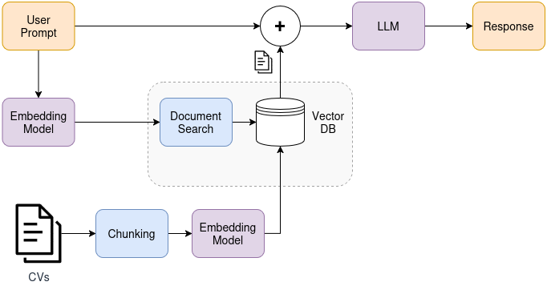

# TP 2: Chatbot sobre CV

Este trabajo presenta un chatbot simple implementando RAG sobre curriculums vitae (CV) de personas. Utiliza Pinecone para la etapa de _retrieval_ y Groq para la etapa de _generation_. La ingesta de datos se realiza vía un script. Las credenciales y configuraciones se importan desde un `.env`, cuya estructura sigue la del [archivo de ejemplo](.env.example).




> [!NOTE]
> Todas las órdenes de consola se asumen desde este directorio (i.e. `TP2`)

## Dependencias

El proyecto gestiona dependencias vía la herramienta `uv`. Para sincronizar las mismas, desde este subdirectorio, ejecutar

```bash
uv sync
```

## Ingesta

Los cv deben ser ubicados en el directorio `docs/`, cuyo contenido no es trackeado en el repositorio. Solo se acepta formato Markdown. Para realizar la ingesta de datos, ejecutar

```bash
uv run ingest.py
```

## Chatbot

El chatbot interactivo es una aplicación de Streamlit que se puede levantar local ejecutando

```bash
uv run streamlit run app.py
```

Una demo se encuentra disponible en [YouTube](https://youtu.be/tkSd-bhJzaE).