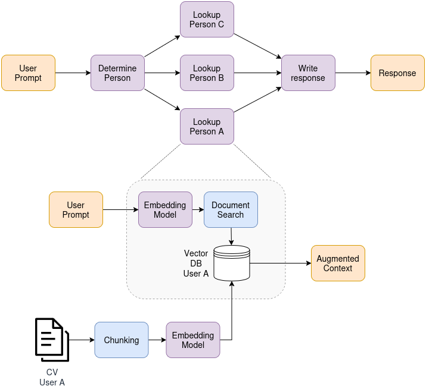

# TP 3: Agente sobre múltiples CV

Este trabajo presenta un agente simple implementando RAG sobre diferentes curriculums vitae (CV) de personas. Utiliza Pinecone para la etapa de _retrieval_ y Groq para la etapa de _generation_ y de determinación de persona _"target"_. La ingesta de datos se realiza vía un script. Las credenciales y configuraciones se importan desde un `.env`, cuya estructura sigue la del [archivo de ejemplo](.env.example).




> [!NOTE]
> Todas las órdenes de consola se asumen desde este directorio (i.e. `TP3`)

## Dependencias

El proyecto gestiona dependencias vía la herramienta `uv`. Para sincronizar las mismas, desde este subdirectorio, ejecutar

```bash
uv sync
```

## Ingesta

Los cv deben ser ubicados en el directorio `docs/`, cuyo contenido no es trackeado en el repositorio. Los CV deben estar en formato markdown y cada archivo debe estar nombrado bajo el formato `<nombre>_<apellido>.md`. Para realizar la ingesta de datos, ejecutar

```bash
uv run ingest.py
```

## Chatbot

El chatbot interactivo es una aplicación de Streamlit que se puede levantar local ejecutando

```bash
uv run streamlit run app.py
```

Una demo se encuentra disponible en [YouTube](https://youtu.be/X6yj1WxADis), donde se puede apreciar:

* Creación dinámica del grafo en base a CVs disponibles.
* Interpretación robusta a errores de tipeo de persona por la que se pregunta, a través de LLMs.
* Default dinámico en base a usuario seleccionado.
* Dispatching dinámico de lookup específico de información por CV.
* Respuesta basada en datos recuperados.